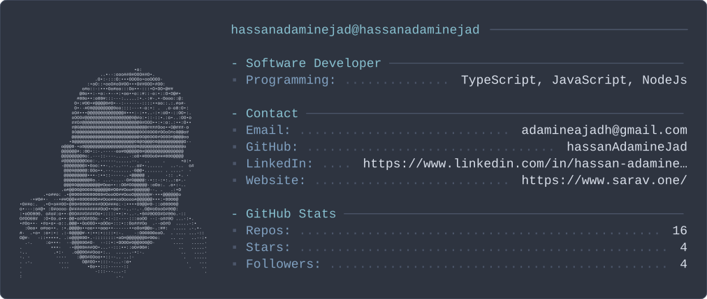

<p align="center">
  
</p>

<h1 align="center">Hi, I'm Hassan 👋</h1>

<p align="center">
  <strong>Senior Full-Stack Developer</strong><br/>
  React • Next.js • TypeScript • Node.js • AI-powered applications
</p>

<p align="center">
  Building scalable web products, developer-friendly architectures,
  automation systems, and AI-driven experiences.
</p>

---

## 👨‍💻 About Me

I'm a software engineer with 10+ years of experience building
production web applications, frontend platforms, internal tools,
automation systems, and full-stack products.

My strongest area is modern frontend engineering with
**React, Next.js and TypeScript**, while I also work across the stack
with **Node.js, GraphQL, PostgreSQL, Supabase and AWS**.

I care about more than shipping features — I focus on
**architecture, maintainability, testing, performance and developer experience**.

- 🚀 Improved web performance by up to **60%**
- 📱 Helped drive **300%+ growth in mobile visits**
- ⚙️ Built **30+ AWS Lambda automations**
- 🧑‍💼 Built products and interfaces serving **600K+ users**
- 🔧 Reduced manual operational work by roughly **35%**
- 🧪 Strong focus on testing, code review and maintainable frontend architecture

---

## 🤖 AI & Intelligent Applications

Recently, I've been especially interested in building
**AI-powered products rather than simply adding AI APIs to existing apps**.

Some areas I'm currently exploring and building around:

- AI-powered interview experiences
- Real-time conversational applications
- Structured LLM workflows
- AI agents and deterministic conversation flows
- Voice / avatar interfaces
- AI-assisted developer and business automation
- Retrieval and structured data pipelines

One of my recent projects is an **AI Interview Platform** designed around
a provider-neutral conversation engine, structured interview flows,
transcripts, resumable sessions and eventually real-time voice/avatar interaction.

---

## 🛠 Tech Stack

### Frontend


### Backend & Data


### Cloud & Tooling


---

## 🧠 What I Enjoy Building

```text
Complex Frontends       ████████████████████
Web Architecture        ███████████████████░
AI Applications         ██████████████████░░
Full-Stack Products     ██████████████████░░
Automation              █████████████████░░░
Performance             ████████████████████
